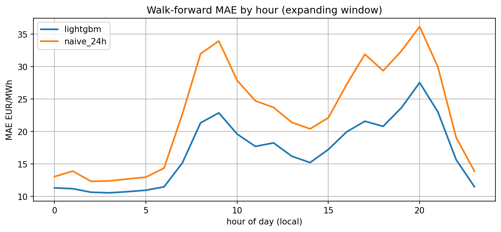

# GR Day-Ahead Electricity Price Forecaster

*English first — [Ελληνικά παρακάτω](#ελληνικά).*

**Live demo:** https://huggingface.co/spaces/georgekrav/gr-day-ahead-price-forecast

Hourly day-ahead electricity price forecasting for the Greek bidding zone
(EIC `10YGR-HTSO-----Y`), built on ENTSO-E Transparency Platform data.
LightGBM against naive baselines, walk-forward backtesting, split-conformal
prediction intervals, and a Streamlit app fed by a daily GitHub Actions
forecast job.

## Problem

Greek day-ahead prices are set in the SDAC auction at 12:00 CET on day D-1.
The task: predict all 24 hourly prices of day D using only information
available before that gate closure. The market is non-stationary — solar
keeps deepening the midday "duck curve" (negative-price hours grew from
0.0% of 2023 to 6.6% of 2026) — which makes both honest evaluation and
calibrated uncertainty the actual engineering problem.

## Data

Three years (June 2023 – June 2026, 26,568 hours) of:

| series | notes |
|---|---|
| day-ahead prices | hourly until 2025-09-30, 15-min after the SDAC MTU switch |
| actual total load | resolution changed 2025-11-12 |
| day-ahead load forecast | published ~10:00 CET on D-1 |
| generation by type | solar, wind onshore, hydro (reservoir + run-of-river), fossil gas |

Everything is stored on tz-aware UTC indices (DST never duplicates or drops
an hour) and cached as monthly parquet chunks. Sub-hourly periods are
averaged to hourly — these are average-power (MW) and unit-price (EUR/MWh)
quantities, so mean is the correct aggregation, and the resolution of each
chunk is detected rather than assumed. Gaps (about 30 hours in three years)
are reported by a data-quality script and left as NaN, never imputed.

## Features and leakage analysis

Forecast issue time is D-1 just before 12:00 CET. Every feature documents
when it becomes available relative to that moment:

| feature | available because |
|---|---|
| price lags 24/48/168 h | prices through D-1 were set in earlier auctions |
| hour, weekday, month, GR holidays | deterministic calendar (Europe/Athens) |
| day-ahead load forecast for D | published ~10:00 CET on D-1 |
| generation lags **48 h** | actuals publish with ~1 h delay, so D-2 is the last complete day — a 24 h lag would leak the unpublished afternoon of D-1 |

Tests enforce this: perturbing data after a cutoff must leave all earlier
features unchanged, perturbing same-hour actuals must leave that hour's
feature row unchanged, and the 48 h generation-lag floor is asserted
directly.

## Results — 12-month walk-forward backtest

Monthly retraining on an expanding window; every scored hour was predicted
by a model that had never seen it or anything after it.

| model | MAE | RMSE | sMAPE |
|---|---|---|---|
| **LightGBM (l1)** | **19.27** | **28.30** | **40.6** |
| naive-24h (same hour yesterday) | 22.53 | 34.31 | 46.0 |
| seasonal-naive-168h (same hour last week) | 27.70 | 41.33 | 52.1 |

14.5% MAE and 17.5% RMSE improvement over the strongest baseline, ahead at
every hour of day except a tie at solar noon. The gains concentrate where
naive forecasts fail: the morning ramp (-29% at 07:00) and the evening peak
(-25% at 17:00-19:00).



A rolling 365-day training window was tested and is slightly worse
(MAE 19.96): monthly retraining already handles the drift, so the extra
history is pure signal. sMAPE is reported for comparability with the EPF
literature but is unstable when prices cross zero — MAE is the headline.

### Prediction intervals

Hand-rolled split-conformal, calibrated per hour of day (errors at 04:00
and 20:00 differ by a factor of three) on the most recent 90 days of
out-of-sample residuals, recalibrated daily:

| nominal | empirical coverage | mean width |
|---|---|---|
| 80% | 78.0% | 63.8 EUR/MWh |
| 95% | 94.4% | 124.8 EUR/MWh |

Calibrating on the full history instead under-covers badly (75.0% / 92.2%)
because old, calmer residuals underestimate current volatility — the recent
window is what keeps the intervals honest under drift.

## Automation

A GitHub Actions cron runs every morning before gate closure: refetches
fresh ENTSO-E data, retrains on the full history (seconds for LightGBM),
forecasts day D+1 with intervals, and commits four small artifacts under
`forecasts/` (latest forecast, append-only track record with actuals filled
in as they publish, conformal calibration, backtest summary). The Streamlit
app is pure presentation on top of those files.

## Limitations

- No wind/solar day-ahead forecasts as features (published after gate
  closure on ENTSO-E); 48 h generation lags are a weaker proxy.
- Coverage sits ~2 points under nominal at the 80% level — residual drift
  that windowed calibration shrinks but does not eliminate.
- Single bidding zone; no cross-border flow or fuel-price features.
- One-day-ahead only; the model is not built for longer horizons.

## Run locally

```bash
conda create -n gr-epf python=3.11 -y
conda activate gr-epf
pip install -e ".[dev]"
cp .env.example .env              # add your ENTSOE_API_KEY

python scripts/download_data.py   # ~5 min cold, cached monthly chunks
python scripts/data_quality_report.py
python scripts/train_model.py     # quick 90-day holdout check
python scripts/backtest.py        # definitive 12-month walk-forward
python scripts/conformal_report.py
python scripts/make_forecast.py   # tomorrow's forecast -> forecasts/
streamlit run app/streamlit_app.py

pytest && ruff check .
```

## Repo layout

```
src/gr_epf/        data, features, models, evaluate, conformal, forecast
scripts/           CLI entry points (download, train, backtest, forecast)
app/               Streamlit app (reads forecasts/ only)
forecasts/         committed artifacts the app and the daily job share
notebooks/         EDA only, nothing imported from here
tests/             pytest, incl. no-leakage and DST/resolution tests
.github/workflows/ daily forecast cron
data/              local parquet cache (gitignored)
```

---

# Ελληνικά

**Ζωντανή εφαρμογή:** https://huggingface.co/spaces/georgekrav/gr-day-ahead-price-forecast

Ωριαία πρόβλεψη των τιμών ηλεκτρικής ενέργειας επόμενης ημέρας για την
ελληνική ζώνη προσφορών (EIC `10YGR-HTSO-----Y`), πάνω σε δεδομένα της
πλατφόρμας διαφάνειας ENTSO-E. LightGBM απέναντι σε naive baselines,
walk-forward backtesting, split-conformal διαστήματα πρόβλεψης, και
εφαρμογή Streamlit που τροφοδοτείται από καθημερινό αυτόματο job στο
GitHub Actions.

## Το πρόβλημα

Οι ελληνικές τιμές επόμενης ημέρας καθορίζονται στη δημοπρασία SDAC στις
12:00 CET της προηγούμενης μέρας (D-1). Ο στόχος: πρόβλεψη και των 24
ωριαίων τιμών της ημέρας D χρησιμοποιώντας μόνο πληροφορία διαθέσιμη πριν
από εκείνο το κλείσιμο. Η αγορά είναι μη στάσιμη — τα ηλιακά βαθαίνουν
συνεχώς τη μεσημεριανή «καμπύλη πάπιας» (οι ώρες με αρνητική τιμή
αυξήθηκαν από 0,0% το 2023 σε 6,6% το 2026) — και αυτό κάνει την τίμια
αξιολόγηση και τη βαθμονομημένη αβεβαιότητα το πραγματικό ζητούμενο.

## Τα δεδομένα

Τρία χρόνια (Ιούνιος 2023 – Ιούνιος 2026, 26.568 ώρες):

| σειρά | σημειώσεις |
|---|---|
| τιμές day-ahead | ωριαίες έως 30/9/2025, 15λεπτες μετά την αλλαγή MTU του SDAC |
| πραγματικό φορτίο | η ανάλυση άλλαξε στις 12/11/2025 |
| πρόβλεψη φορτίου D-1 | δημοσιεύεται ~10:00 CET της προηγούμενης μέρας |
| παραγωγή ανά τύπο | ηλιακά, αιολικά, υδροηλεκτρικά (ταμιευτήρα + ποταμού), φυσικό αέριο |

Όλα αποθηκεύονται σε δείκτες UTC (η αλλαγή ώρας δεν διπλασιάζει ούτε
χάνει ποτέ ώρα) σε μηνιαία αρχεία parquet. Τα υπο-ωριαία διαστήματα
μετατρέπονται σε ωριαία με μέσο όρο — πρόκειται για μέση ισχύ (MW) και
μοναδιαία τιμή (EUR/MWh), άρα ο μέσος είναι η σωστή πράξη — και η ανάλυση
κάθε κομματιού ανιχνεύεται αντί να θεωρείται δεδομένη. Τα κενά (περίπου
30 ώρες σε τρία χρόνια) αναφέρονται από script ποιότητας και μένουν NaN —
ποτέ δεν συμπληρώνονται με εφευρημένες τιμές.

## Χαρακτηριστικά και ανάλυση διαρροής (leakage)

Η πρόβλεψη εκδίδεται την D-1, λίγο πριν τις 12:00 CET. Κάθε feature
τεκμηριώνει πότε γίνεται διαθέσιμο σε σχέση με εκείνη τη στιγμή:

| feature | διαθέσιμο επειδή |
|---|---|
| υστερήσεις τιμής 24/48/168 ω. | οι τιμές έως την D-1 βγήκαν σε προηγούμενες δημοπρασίες |
| ώρα, ημέρα, μήνας, αργίες | ντετερμινιστικό ημερολόγιο (Europe/Athens) |
| πρόβλεψη φορτίου για την D | δημοσιεύεται ~10:00 CET της D-1 |
| υστερήσεις παραγωγής **48 ω.** | τα πραγματικά δημοσιεύονται με ~1 ώρα καθυστέρηση, άρα η D-2 είναι η τελευταία πλήρης μέρα — υστέρηση 24 ω. θα διέρρεε το αδημοσίευτο απόγευμα της D-1 |

Αυτά επιβάλλονται από tests: διαταραχή των δεδομένων μετά από ένα σημείο
πρέπει να αφήνει όλα τα προγενέστερα features ανέγγιχτα, και το κατώφλι
των 48 ωρών ελέγχεται ρητά.

## Αποτελέσματα — 12μηνο walk-forward backtest

Μηνιαία επανεκπαίδευση σε διευρυνόμενο παράθυρο· κάθε βαθμολογημένη ώρα
προβλέφθηκε από μοντέλο που δεν είχε δει ποτέ ούτε αυτήν ούτε οτιδήποτε
μεταγενέστερο.

| μοντέλο | MAE | RMSE | sMAPE |
|---|---|---|---|
| **LightGBM (l1)** | **19,27** | **28,30** | **40,6** |
| naive-24h (ίδια ώρα χθες) | 22,53 | 34,31 | 46,0 |
| seasonal-naive-168h (ίδια ώρα πριν 1 εβδ.) | 27,70 | 41,33 | 52,1 |

Βελτίωση 14,5% στο MAE και 17,5% στο RMSE από το ισχυρότερο baseline, με
το μοντέλο μπροστά σε κάθε ώρα της ημέρας εκτός από ισοπαλία στο ηλιακό
μεσημέρι. Τα κέρδη συγκεντρώνονται εκεί όπου τα naive αποτυγχάνουν: στην
πρωινή άνοδο (−29% στις 07:00) και στη βραδινή αιχμή (−25% στις
17:00–19:00).


Δοκιμάστηκε και κυλιόμενο παράθυρο εκπαίδευσης 365 ημερών — ελαφρώς
χειρότερο (MAE 19,96): η μηνιαία επανεκπαίδευση αρκεί για την προσαρμογή,
οπότε η επιπλέον ιστορία είναι καθαρό σήμα. Το sMAPE αναφέρεται για
συγκρισιμότητα με τη βιβλιογραφία αλλά είναι ασταθές όταν οι τιμές
περνούν το μηδέν — επίσημη μετρική είναι το MAE.

### Διαστήματα πρόβλεψης

Χειροποίητο split-conformal, βαθμονομημένο ανά ώρα της ημέρας (τα
σφάλματα στις 04:00 και στις 20:00 διαφέρουν κατά συντελεστή τρία) στις
πιο πρόσφατες 90 ημέρες out-of-sample σφαλμάτων, με ημερήσια
επαναβαθμονόμηση:

| ονομαστικό | εμπειρική κάλυψη | μέσο πλάτος |
|---|---|---|
| 80% | 78,0% | 63,8 EUR/MWh |
| 95% | 94,4% | 124,8 EUR/MWh |

Η βαθμονόμηση σε όλη την ιστορία υπο-καλύπτει αισθητά (75,0% / 92,2%),
γιατί τα παλιά, ηρεμότερα σφάλματα υποτιμούν τη σημερινή μεταβλητότητα —
το πρόσφατο παράθυρο είναι αυτό που κρατά τα διαστήματα τίμια κάτω από
συνθήκες ολίσθησης (drift).

## Αυτοματοποίηση

Ένα cron του GitHub Actions τρέχει κάθε πρωί πριν από το κλείσιμο της
αγοράς: ξανακατεβάζει φρέσκα δεδομένα ENTSO-E, επανεκπαιδεύει σε όλη την
ιστορία (δευτερόλεπτα για το LightGBM), προβλέπει την ημέρα D+1 με
διαστήματα, και κάνει commit τέσσερα μικρά αρχεία στο `forecasts/`
(τρέχουσα πρόβλεψη, ιστορικό επιδόσεων που συμπληρώνεται με τις
πραγματικές τιμές μόλις δημοσιευτούν, βαθμονόμηση conformal, σύνοψη
backtest). Η εφαρμογή Streamlit είναι καθαρή παρουσίαση πάνω σε αυτά τα
αρχεία.

## Περιορισμοί

- Δεν χρησιμοποιούνται day-ahead προβλέψεις αιολικής/ηλιακής παραγωγής ως
  features (στο ENTSO-E δημοσιεύονται μετά το κλείσιμο της αγοράς)· οι
  υστερήσεις 48 ωρών είναι ασθενέστερο υποκατάστατο.
- Η κάλυψη μένει ~2 μονάδες κάτω από την ονομαστική στο επίπεδο 80% —
  υπόλειμμα drift που το παράθυρο βαθμονόμησης μικραίνει αλλά δεν
  εξαλείφει.
- Μία ζώνη προσφορών· χωρίς features διασυνδέσεων ή τιμών καυσίμων.
- Μόνο μία ημέρα μπροστά· το μοντέλο δεν είναι φτιαγμένο για μεγαλύτερους
  ορίζοντες.

## Τοπική εκτέλεση

```bash
conda create -n gr-epf python=3.11 -y
conda activate gr-epf
pip install -e ".[dev]"
cp .env.example .env              # βάλε το δικό σου ENTSOE_API_KEY

python scripts/download_data.py   # ~5 λεπτά την πρώτη φορά, μηνιαίο cache
python scripts/data_quality_report.py
python scripts/train_model.py     # γρήγορος έλεγχος σε holdout 90 ημερών
python scripts/backtest.py        # το οριστικό 12μηνο walk-forward
python scripts/conformal_report.py
python scripts/make_forecast.py   # αυριανή πρόβλεψη -> forecasts/
streamlit run app/streamlit_app.py

pytest && ruff check .
```

## Δομή του repository

```
src/gr_epf/        δεδομένα, features, μοντέλα, αξιολόγηση, conformal, forecast
scripts/           εργαλεία γραμμής εντολών (λήψη, εκπαίδευση, backtest, πρόβλεψη)
app/               εφαρμογή Streamlit (διαβάζει μόνο το forecasts/)
forecasts/         τα committed αρχεία που μοιράζονται app και ημερήσιο job
notebooks/         μόνο EDA, τίποτα δεν γίνεται import από εδώ
tests/             pytest, μαζί με tests μη-διαρροής και αλλαγής ώρας/ανάλυσης
.github/workflows/ ημερήσιο cron πρόβλεψης + συγχρονισμός HF Space
data/              τοπικό parquet cache (εκτός git)
```
